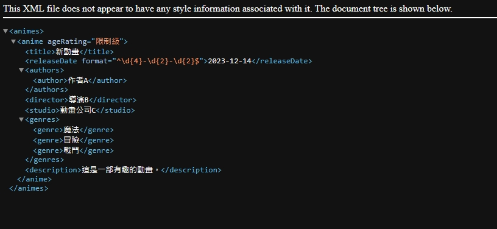

## HW3：XML動態網頁實習

> 註：我已經將網站部署到github page上，可以透過以下連結訪問。

> 網頁連結：_[https://imp1ication.github.io/wcx_hw3/](https://imp1ication.github.io/wcx_hw3/)_

---

### 一、標題：動畫資料XML產生器

這個網站是一個動畫資料 XML 生成器。使用者可以填寫動畫的相關資訊，包括作品名稱、首播日期、分級、原著作者、導演監督、製作廠商、作品類型以及作品描述。在使用者填寫完所有必填欄位並點擊「產生 XML」按鈕後，網站會先檢查輸入是否合法，如果輸入不符格式，網站會顯示提示訊息。

如果輸入合法，網站會根據預先準備好的anime_template.xml與使用者的輸入生成相應的 XML 文件，使用者可以選擇下載生成的 XML 文件。

### 二、實作說明

#### 1. anime_template.xml

> 檔案連結：_[https://github.com/Imp1ication/wcx_hw3/blob/master/anime_template.xml](https://github.com/Imp1ication/wcx_hw3/blob/master/anime_template.xml)_

這個XML模板是用來產生動畫資訊的XML文件，我使用了DTD來定義XML的結構與屬性的規則。

```xml
<!DOCTYPE animes [
  <!ELEMENT animes (anime+)>
  <!ELEMENT anime (title, releaseDate, authors, director, studio, genres, description)>
  <!ATTLIST anime ageRating (限制級|輔導級|保護級|普遍級) "普遍級" >
  <!ELEMENT title (#PCDATA)>

  <!ELEMENT releaseDate (#PCDATA)>
  <!ATTLIST releaseDate
    format CDATA "^\d{4}-\d{2}-\d{2}$"
  >

  <!ELEMENT authors (author+)>
  <!ELEMENT author (#PCDATA)>
  <!ELEMENT director (#PCDATA)>
  <!ELEMENT studio (#PCDATA)>

  <!ELEMENT genres (genre*)>
  <!ELEMENT genre (#PCDATA)>

  <!ELEMENT description (#PCDATA)>
]>
```

DTD的說明如下：

- 這份 DTD 定義了`animes`元素，其中包含一個或多個`anime`元素。

- 每個`anime`元素代表一部動畫，包含了標題（title）、首播日期（releaseDate）、原著作者（authors）、導演監督（director）、製作廠商（studio）、作品類型（genres）、以及作品描述（description）等資訊。

- 其中，`anime`的`ageRating`屬性用於標識動畫的分級，限定取值為`限制級`、`輔導級`、`保護級`或`普遍級`，預設值為`普遍級`。

- 另外，`releaseDate`中的`format`屬性則限制了`releaseDate`的格式必須為`YYYY-MM-DD`，以確保日期的正確性。

這樣的設計確保了生成的XML符合特定的資料結構和格式，並確保資料的合法性。

以下即是符合上述DTD的一個XML文件模板：

```xml
<animes>
  <anime ageRating="保護級">
    <title>Animation Title</title>
    <releaseDate>2023-12-08</releaseDate>

    <authors>
      <author>Author1</author>
      <author>Author2</author>
    </authors>

    <director>Director</director>
    <studio>Hello Studio</studio>

    <genres>
      <genre>Action</genre>
      <genre>Adventure</genre>
    </genres>

    <description>A brief description of the animation.</description>
  </anime>
</animes>
```

#### 2. HTML 表單

> 檔案連結：_[https://github.com/Imp1ication/wcx_hw3/blob/master/index.html](https://github.com/Imp1ication/wcx_hw3/blob/master/index.html)_

網站提供了一個簡單的HTML表單，允許使用者填寫動畫的相關資訊，並且在使用者點擊「產生 XML」按鈕後，使用JavaScript檢查輸入是否合法，如果合法，則生成XML文件並提供下載,否則顯示錯誤訊息。

```html
<!-- HTML 表單 -->
<form id="animationForm" action="javascript:void(0);">
  <!-- 各項動畫資訊的輸入欄位 -->
  <!-- ... -->

  <!-- 產生 XML 按鈕 -->
  <div id="buttonContainer">
    <button type="button" onclick="validateInput()">產生 XML</button>
  </div>
</form>
```

#### 3. JavaScript 功能

> 檔案連結：_[https://github.com/Imp1ication/wcx_hw3/blob/master/script.js](https://github.com/Imp1ication/wcx_hw3/blob/master/script.js)_

為了實現動畫資料 XML 生成器的功能，我使用了 XMLHttpRequest 和 DOM 操作的技術來以動態的方式處理使用者的輸入，並生成相應的 XML 文件。

##### 3.1 使用 XMLHttpRequest 讀取 XML 模板

首先，我使用了 XMLHttpRequest 來異步讀取預定義的 XML 模板`anime_template.xml`。這允許我們在不刷新整個頁面的情況下，動態地獲取 XML 模板的內容。

```javascript
function generateXML() {
  var xhttp = new XMLHttpRequest();

  xhttp.onreadystatechange = function () {
    if (this.readyState === 4 && this.status === 200) {
      var xmlDoc = this.responseXML;

      // ...後續處理
    }
  };

  xhttp.open("GET", "anime_template.xml", true);
  xhttp.send();
}
```

##### 3.2 使用 DOM 操作生成 XML 文件

一旦成功讀取 XML 模板，我使用 DOM 操作來填充模板的相應節點與屬性。

```javascript
function generateXML() {
  var xhttp = new XMLHttpRequest();

  xhttp.onreadystatechange = function () {
    if (this.readyState === 4 && this.status === 200) {
      var xmlDoc = this.responseXML;

      // 取得表單中的值...
      // ...

      // 填充XML模板
      xmlDoc.querySelector("anime").setAttribute("ageRating", ageRating);
      xmlDoc.querySelector("title").textContent = title;
      xmlDoc.querySelector("releaseDate").textContent = releaseDate;

      // 清空authors和genres，然后重新填充
      var authorsElement = xmlDoc.querySelector("authors");
      authorsElement.innerHTML = "";

      authors.forEach(function (author) {
        var authorElement = xmlDoc.createElement("author");
        authorElement.textContent = author.trim();
        authorsElement.appendChild(authorElement);
      });

      // 其他節點填充...
      // ...

      // 生成XML字符串
      var xmlString = new XMLSerializer().serializeToString(xmlDoc);

      // ...後續處理
    }
  };

  xhttp.open("GET", "anime_template.xml", true);
  xhttp.send();
}
```

##### 3.3 使用 Blob 和 下載連結

最後，我使用 Blob 創建一個 XML 文件，並通過創建的下載連結提供給使用者。這也是使用 DOM 操作來動態生成和添加元素的例子。

```javascript
function generateXML() {
  // ...

  // 生成XML字符串
  var xmlString = new XMLSerializer().serializeToString(xmlDoc);

  // 創建Blob並提供下載連結
  var blob = new Blob([xmlString], { type: "text/xml" });

  // 創建下載XML的按鈕
  var downloadButton = document.createElement("button");
  downloadButton.textContent = "下載 XML";
  downloadButton.className = "download-button";
  downloadButton.onclick = function () {
    var link = document.createElement("a");
    link.href = window.URL.createObjectURL(blob);
    link.download = "generated.xml";
    link.click();
  };

  // ...其他DOM操作，將下載按鈕添加到頁面上
}
```

---

### 三、實做畫面

- 網頁表單。

  

- 輸入合法，點擊「產生 XML」按鈕後，會生成 XML 文件並提供下載。

  

- 產生的 XML 文件。

  

- 輸入不合法，點擊「產生 XML」按鈕後，會顯示錯誤訊息。

  

---

### 四、討論

整個動畫資訊 XML 產生器的實作過程中，我們探討了XML模板的DTD定義，確保生成的XML符合結構和格式的標準。在前端實現中，我們著重於DOM操作和XMLHttpRequest的使用，使得動態生成XML的過程更加流暢。
